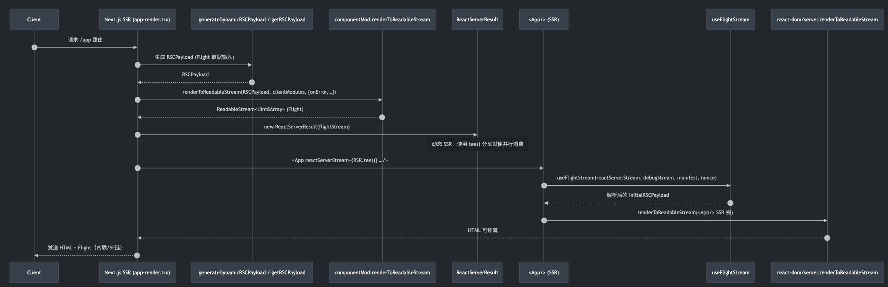
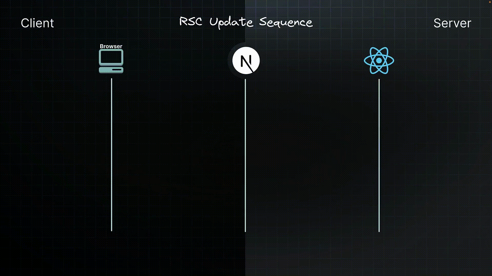
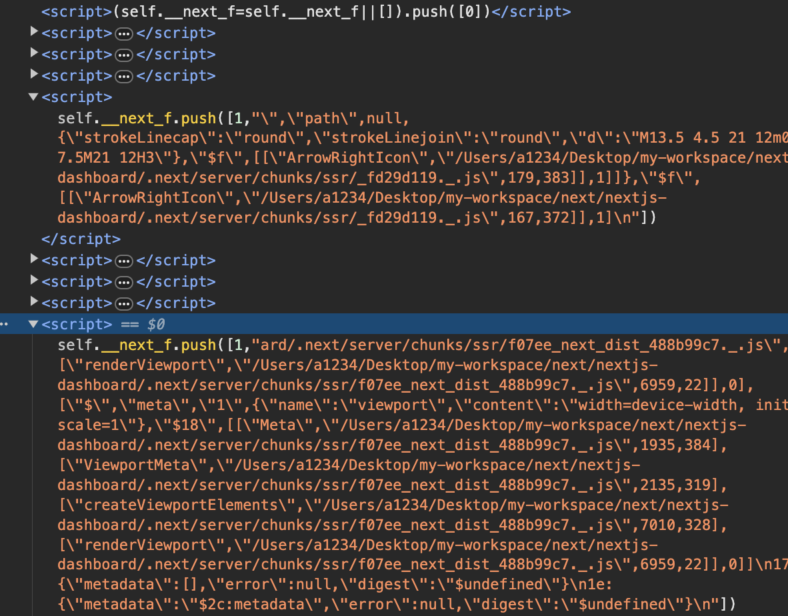

# RSC整体渲染流程

## 流程图



## rsc从服务端到客户端的渲染流程

初始加载序列


- 当您的浏览器请求一个页面时，`Next.js` 应用路由器将请求的 `URL` 与一个服务器组件匹配。然后 `Next.js` 指示 `React` 渲染该服务器组件。
- `React` 渲染服务器组件以及任何同样是服务器组件的子组件，将它们转换成一种称为 `RSC` 负载的特殊 `JSON` 格式。如果任何服务器组件挂起，`React` 会暂停渲染那个子树，并发送一个占位符值。
- 与此同时，客户端组件按照后续生命周期中的指令进行准备。
- `Next.js` 使用 `RSC Payload` 和 `Client Component JavaScript` 指令在服务器上生成 `HTML`。这个 `HTML` 被流式传输到你的浏览器，以便立即显示路由的快速、非交互式预览。
- `Next.js` 在 `React` 渲染每个 `UI` 单元时，会并行流式传输 `RSC` 负载。
- 在浏览器中，`Next.js` 处理流式的 `React`响应。`React` 使用 `RSC` 负载和客户端组件指令来逐步渲染 UI。
- 客户端组件和服务器组件的输出全部加载完毕后，最终的 UI 状态将呈现给用户。
- 客户端组件经历水合作用，将我们的应用程序从静态显示转变为交互式体验。

更新序列


- 浏览器请求重新获取特定的 `UI`，例如完整路由。
- `Next.js` 处理请求并将其与请求的服务器组件匹配。`Next.js` 指示 `React` 渲染组件树。`React` 渲染组件，类似于初始加载。
- 但与初始序列不同，更新时不会生成 `HTML`。`Next.js` 会逐步将响应数据流式传输回客户端。
在接收到流式响应后，`Next.js` 使用新的输出触发路由的重新渲染。
- `React` 将新渲染的输出与屏幕上现有的组件进行协调（合并）。由于 `UI` 描述是一种特殊的 `JSON` 格式而不是 `HTML`，`React` 可以在保留关键 `UI` 状态（如焦点或输入值）的同时更新 `DOM`。

## __next_f

在next的源码中我们可以找到`__next_f`这个全局变量被注入到了最终的`HTML`中。

```ts
let scriptContents = `(self.__next_f=self.__next_f||[]).push(${htmlEscapeJsonString(
  JSON.stringify([INLINE_FLIGHT_PAYLOAD_BOOTSTRAP])
)})`
```
浏览器中会找到连续的这些`self.__next_f.push`的脚本



这个`self.__next_f`数组其实就是我们的`RSC`负载，一种特殊的用来解释`RSC`组件的`JSON`格式

我们可以看到数组中的字数组由一个 **数字标识** 和 **字符串** 组成，数字标识位`0`时不存在第二个字符串

在`packages/next/src/client/app-index.tsx`下我们可以找到`__next_f`的类型定义`NextFlight`

```ts
type FlightSegment =
  | [isBootStrap: 0]
  | [isNotBootstrap: 1, responsePartial: string]
  | [isFormState: 2, formState: any]
  | [isBinary: 3, responseBase64Partial: string]

type NextFlight = Omit<Array<FlightSegment>, 'push'> & {
  push: (seg: FlightSegment) => void
}

declare global {
  // If you're working in a browser environment
  interface Window {
    /**
     * request ID, dev-only
     */
    __next_r?: string
    __next_f: NextFlight
  }
}
```

可以看到`RSC`负载分为4种类型 
- 1: 引导负载（Bootstrap Payload）
- 2: 非引导负载（Non-Bootstrap Payload）存储字符串   
- 3: 表单状态负载（Form State Payload）存储状态字符串
- 4: 二进制负载（Binary Payload）存储base64字符串